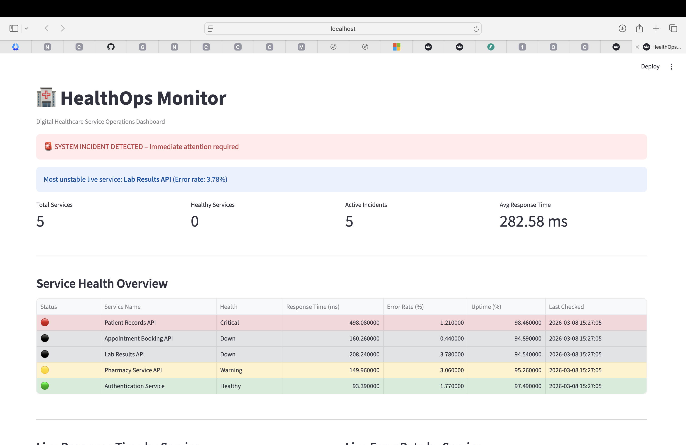
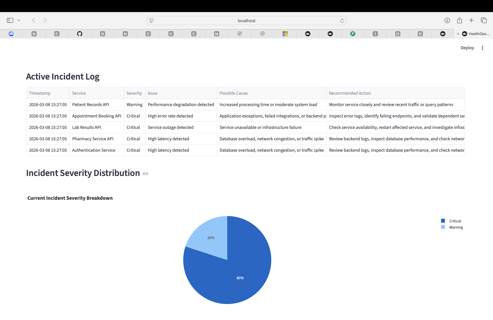
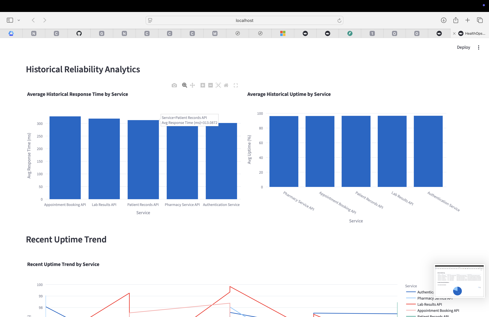
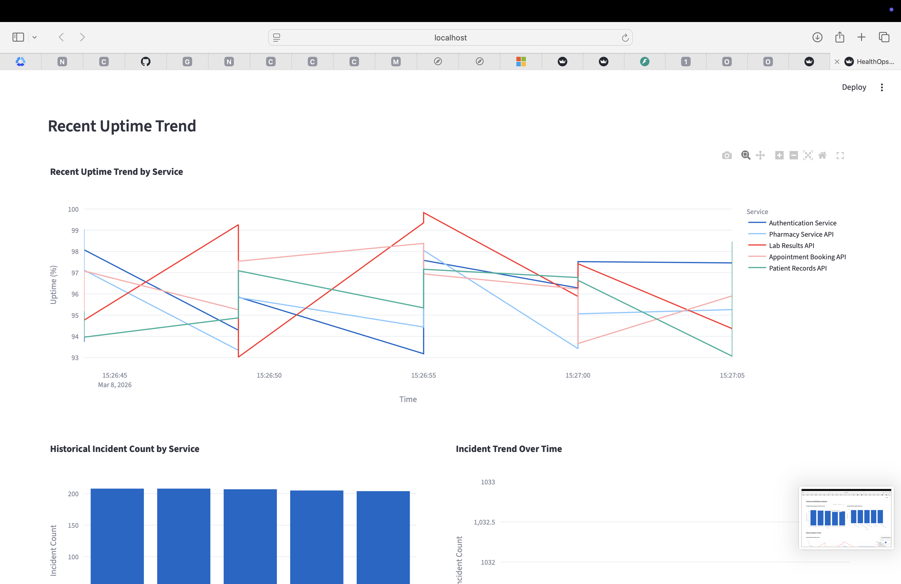
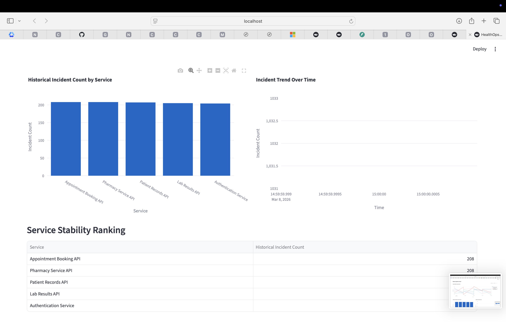
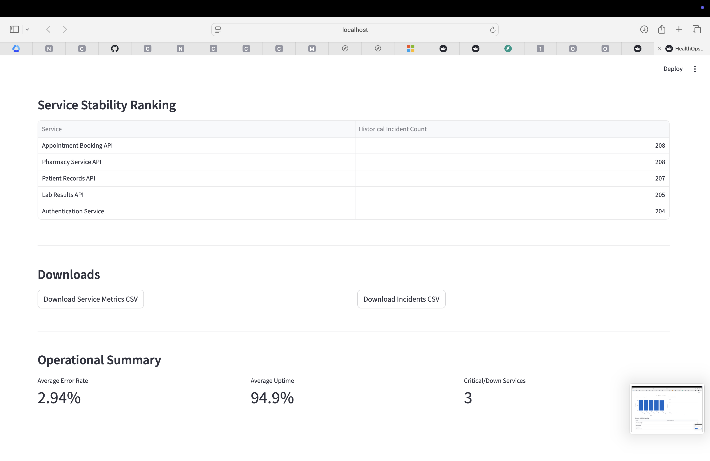

# HealthOps Monitor

A healthcare reliability monitoring platform for analysing service health, detecting operational incidents, and visualising system performance through a real-time monitoring dashboard.

HealthOps Monitor simulates how digital healthcare infrastructure can be monitored and supported operationally. The platform tracks service metrics, detects anomalies, stores operational history, and presents insights through an interactive dashboard.

---

## Overview

Modern healthcare platforms rely on multiple interconnected services that must remain reliable at all times. Systems such as patient records, appointment scheduling, authentication, laboratory services, and pharmacy systems form the backbone of digital healthcare.

HealthOps Monitor simulates a monitoring environment where multiple healthcare services are continuously observed. The system collects operational metrics, detects anomalies, records incidents, and visualises system behaviour through a monitoring dashboard.

This project demonstrates practical concepts in:

- service observability  
- operational monitoring  
- incident detection  
- reliability analytics  
- monitoring dashboards  

---

## Dashboard Preview

### System Overview


### Live Service Metrics


### Incident Management Log


### Incident Severity Distribution


### Historical Reliability Analytics


### Service Uptime Trend


### Incident Trend Analysis


### Service Stability Ranking


---

## Core Features

### Service Monitoring

The platform continuously monitors simulated healthcare services and evaluates operational metrics such as:

- response time  
- error rate  
- uptime percentage  
- service health status  

Example services monitored:

- Patient Records API  
- Appointment Booking API  
- Laboratory Results API  
- Pharmacy Service API  
- Authentication Service  

---

### Incident Detection

An incident detection engine evaluates service behaviour and identifies abnormal system conditions including:

- high response latency  
- elevated error rates  
- service instability  
- service outages  

Detected incidents are classified by severity and enriched with contextual information such as possible causes and recommended actions.

---

### Operational Dashboard

The monitoring dashboard provides a real-time operational view of the system including:

- service health overview  
- response time analytics  
- error rate monitoring  
- incident logs  
- incident severity distribution  
- operational summary metrics  

This enables quick identification of degraded or unstable services.

---

### Historical Reliability Analytics

Operational data is stored to support historical analysis of system behaviour.

The platform provides insights including:

- average response time by service  
- average uptime by service  
- incident frequency by service  
- incident trend analysis  
- service stability ranking  

These insights help identify long-term reliability patterns.

---

### Automated Incident Reporting

Critical incidents automatically generate structured reports stored in the `reports` directory.

Each report includes:

- timestamp  
- affected service  
- severity classification  
- issue description  
- possible cause  
- recommended remediation action  

---

## System Architecture

```
Streamlit Monitoring Dashboard
        │
        │ REST API
        │
FastAPI Backend
        │
        ├─────────────── Service Simulator
        │
        ├─────────────── Incident Detection Engine
        │
        └─────────────── Logging & Data Storage
                        │
                        ├── service_metrics.csv
                        ├── incidents.csv
                        └── incident reports
```

---

## Technology Stack

| Layer | Technology |
|------|------------|
| Backend API | FastAPI |
| Dashboard | Streamlit |
| Data Processing | Pandas |
| Visualisation | Plotly |
| Programming Language | Python |
| Data Storage | CSV log files |

---

## Project Structure

```
healthops-monitor
│
├── backend
│   ├── main.py
│   ├── services.py
│   ├── simulator.py
│   ├── incident_engine.py
│   └── models.py
│
├── dashboard
│   └── app.py
│
├── data
│   ├── service_metrics.csv
│   └── incidents.csv
│
├── reports
│   └── incident report files
│
├── screenshots
│   └── dashboard images
│
├── requirements.txt
├── README.md
└── .gitignore
```

---

## Running the System

### Start Backend API

```
python3 -m uvicorn backend.main:app --reload --port 8001
```

### Start Monitoring Dashboard

```
streamlit run dashboard/app.py
```

Open the dashboard:

```
http://localhost:8501
```

---

## Example Operational Insights

The monitoring platform can identify insights such as:

- services with the highest error rates  
- services experiencing the most incidents  
- average response time across services  
- uptime reliability trends  
- incident severity distribution  
- service stability rankings  

These insights help understand and improve system reliability.

---

## Future Improvements

Potential enhancements include:

- real-time alert notifications  
- predictive incident detection  
- automated remediation workflows  
- integration with monitoring systems  
- persistent database storage  
- distributed service monitoring

---

## License

This project is intended for educational and demonstration purposes.